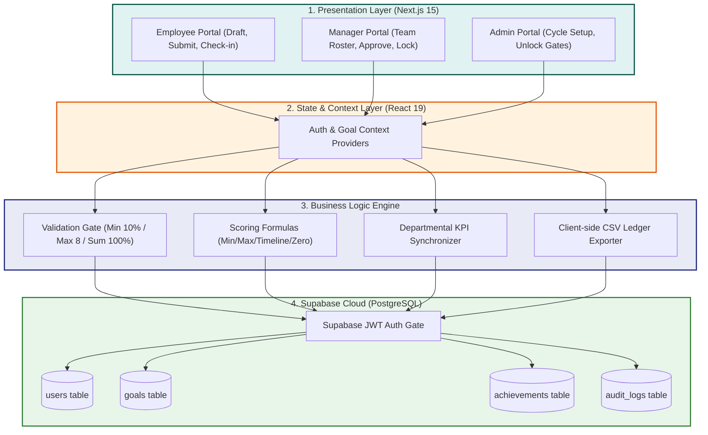

# 🏆 AtomQuest Hackathon 1.0 - Welcome to GoalStream!
## In-House Goal Setting & Tracking Portal Submission

---

> [!IMPORTANT]
> 🔗 **Live Demo URL:** [https://in-house-goal-setting-tracking-portal.vercel.app/](https://in-house-goal-setting-tracking-portal.vercel.app/)  
> 💻 **GitHub Source Code:** [https://github.com/Mohanteja0886/IN-HOUSE-GOAL-SETTING-TRACKING-PORTAL](https://github.com/Mohanteja0886/IN-HOUSE-GOAL-SETTING-TRACKING-PORTAL)

---

## 1. Hey Judges! Here's the GoalStream Story 🚀

Offline appraisal cycles, messy email chains, and outdated goal spreadsheets are a nightmare for team alignment. We built **GoalStream** to solve this once and for all. We wanted to design a digital goal-tracking portal that doesn't just check boxes, but feels lightning fast, looks stunning (both on your phone and laptop), and enforces rock-solid validation rules. 

### Why we chose this Tech Stack:
*   **Next.js 15 (React 19 & App Router):** We wanted instant page transitions, nested layouts, and clean routing structures.
*   **Tailwind CSS & Modern HSL Variables:** No generic plain colors. We custom-crafted balanced HSL color themes, smooth micro-interactions, responsive side-drawers, and glowing metrics cards.
*   **Real Supabase Cloud Backend (PostgreSQL):** We didn't cheat with mock local storage! GoalStream is backed by a **live, production-ready Supabase PostgreSQL cloud database**. Every time an employee submits a goal, a manager locks a sheet, or someone adds a progress comment, it updates in real-time in the cloud.

---

## 2. Key Features We Hand-Coded 🛠️

We spent late nights making sure every requirement in the BRD was fully built, robust, and completely functional:

### 📐 Phase 1: Goal Setup, Strict Validations & L1 Approvals
*   **Built-in Constraint Rules:** The portal checks goal inputs on the fly. If your individual goal weightage is under **10%**, if you try to add more than **8 goals**, or if your cumulative weightage is **not exactly 100%**, the app stops you and shows a helpful error state.
*   **L1 Approvals & Safety Locks:** Managers have an elegant team roster where they can review submitted sheets, edit weights/targets inline, or reject them back for rework. Once the manager clicks "Approve", the sheet is **locked down**—preventing any edits from the employee unless an HR Admin overrides the lock.
*   **Shared Departmental KPIs:** Managers can push shared goal templates to reportees. Employees can adjust the weightage to fit their allocation, but the title and target remain read-only. Updates made by the primary owner sync instantly across all linked sheets!

### 📊 Phase 2: Live Achievement Tracking & Math Scoring Formulas
*   **Log Quarterly Progress:** A clean check-in panel allows employees to record actual achievements for Q1, Q2, Q3, and Q4, and choose a trajectory status (*Not Started / On Track / Completed*).
*   **Structured Check-in Comments:** Managers can log feedback on each review. The portal appends these as a chronological comment history directly onto the goal sheet.
*   **Real Mathematical Scoring Engines:** Yes, we wrote the actual progress calculation formulas!
    *   **Min (Higher is better):** `Actual Achievement ÷ Planned Target` (e.g. Sales targets).
    *   **Max (Lower is better):** `Planned Target ÷ Actual Achievement` (e.g. Turnaround time, cost reduction).
    *   **Timeline:** Dates-based evaluation comparing actual completion vs deadline.
    *   **Zero-based:** Safe-gate metrics where `0` incidents = `100%`, and any other number = `0%`.

### 💼 Reports & System Governance
*   **Interactive Achievement Matrix:** An exportable matrix showing employee achievements. Clicking "Export CSV" generates a real, zero-overhead spreadsheet download!
*   **Completion Dashboards:** Visual compliance bars showing which team members have completed their quarterly check-ins.
*   **Real-time Audit Logs:** Logs critical changes made to goals after their lock date, capturing who did what and when in a clean, color-coded feed.

---

## 3. How GoalStream Works (Our Architecture Flow)

Here is a clean, top-down look at how the frontend presentation layers, context state providers, business logic engines, and database tables communicate:

---

## 4. Judges Testing Guide & Seeded Profiles 🔑

We seeded the database with 4 ready-to-use profiles to make your evaluation super easy and fun. All profiles use the same password: **`password123`**

| Role | Username / Email | Password | What to try out! |
| :--- | :--- | :--- | :--- |
| 🧑‍💻 **Employee 1** | `sarah@atomquest.com` | `password123` | Draft and configure goals under strict validation, check out read-only titles for departmental shared goals, log quarterly check-in progress. |
| 🧑‍💻 **Employee 2** | `michael@atomquest.com` | `password123` | Review Max Turnaround Time (TAT) metrics, and submit completed sheets. |
| 👑 **L1 Manager** | `manager@atomquest.com` | `password123` | Push departmental KPIs, edit targets/weights inline, approve and lock goal sheets, view live SVG graphs, download CSV compliance spreadsheets. |
| 🛡️ **HR Admin** | `admin@atomquest.com` | `password123` | Set up goal cycles, override locks to open sheets for rework, inspect system-wide audit logs, monitor heatmaps. |

---

### A Final Note from Us 💬
We put a lot of heart, passion, and late nights into polishing the user experience—from mobile responsive navigation menus and search features, to real-time notifications and HSL border aura glows. We hope you enjoy playing around with **GoalStream** as much as we loved coding it! We'd love to hear your feedback! 

*Thank you for evaluating our project!*
