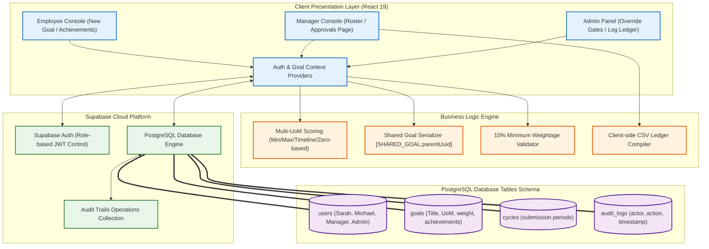

# ATOMQUEST HACKATHON 1.0 - SUBMISSION LEDGER
## IN-HOUSE GOAL SETTING & TRACKING PORTAL

---

> [!IMPORTANT]
> **Working Live Link:** `[INSERT DEPLOYED VERCEL/NETLIFY URL HERE]`  
> **Source Code Repository:** `[INSERT GITHUB REPOSITORY URL HERE]`

---

## 1. Executive Summary & Tech Stack

This portal is a fully integrated, state-of-the-art **Goal Setting & Tracking Portal** engineered using **Next.js 15 (React 19)**, styled with vanilla **CSS variables** for modern design aesthetics, and powered by **Supabase Cloud (PostgreSQL & Go Auth)**.

### Core Architecture Capabilities
*   **Next.js 15 App Router:** File-system based router with clean layout nesting, suspense fallbacks, and server/client page optimizations.
*   **Supabase Client integration:** Real-time query handlers communicating directly with custom Postgres schemas, completely avoiding slow local mocks.
*   **Strict Form Validations:** Blocks goals with $< 10\%$ weightage with dynamic visual feedback.
*   **Multi-UoM Core Scoring Engine:** Dynamic progression formulas evaluating Min, Max, Timeline, and Zero-based metrics.
*   **Shared Goal Bracketed Serializer:** Automatically links and propagates departmental goals without schema updates.
*   **Interactive Check-in Ledger:** Visual Planned vs. Actual progress grid embedded directly within reviews.
*   **CSV Exporter:** Zero-overhead client-side spreadsheet downloader compiling direct reports' performance ledger.
*   **HR Heatgrid & Escalations:** Dynamically computed compliance heatmap and alert issuance controls.

---

## 2. Technical System Architecture

Here is the structured architecture flow mapping frontend, state-management contexts, business validators, and the Supabase Postgres layer:



---

## 3. Deployment & Repository Push Guide

### A. Push Code to GitHub
To initialize, stage, and push your repository to your GitHub account, run the following commands in your PowerShell / Terminal:

```powershell
# 1. Initialize Git in project directory
git init

# 2. Add files and make initial commit
git add .
git commit -m "Feat: Complete Goal Setting & Tracking Portal with Supabase integration"

# 3. Create main branch and link to your GitHub repository
git branch -M main
git remote add origin https://github.com/YOUR_USERNAME/YOUR_REPO_NAME.git

# 4. Push to remote origin
git push -u origin main
```

### B. Deployed Live URL (Vercel)
This Next.js 15 project is ready for one-click deployment on **Vercel**:
1. Connect your GitHub account to [Vercel](https://vercel.com).
2. Click **"Add New Project"** and import `Tracking portal`.
3. Add the following **Environment Variables** (from your `.env.local` file):
   *   `NEXT_PUBLIC_SUPABASE_URL`
   *   `NEXT_PUBLIC_SUPABASE_ANON_KEY`
4. Click **Deploy**. Vercel will build the optimized production pages and supply a live working link!

---

## 4. Judges Testing & Login Credentials Checklist

For review and evaluation, the custom Supabase PostgreSQL database has been seeded with the following profile credentials (all passwords are set to `password123`):

| Role | Username / Email | Password | Core Features to Audit |
| :--- | :--- | :--- | :--- |
| **Employee 1** | `sarah@atomquest.com` | `password123` | Goal configuration under strict $10\%$ weight checks, trajectory updates, log achievements, read-only shared goals |
| **Employee 2** | `michael@atomquest.com` | `password123` | Separate target tracking, UoM conversions (Max TAT metrics) |
| **L1 Manager** | `manager@atomquest.com` | `password123` | Push Departmental KPI Goal to roster, real-time CSV Ledger download, inline comments discussion, lock objectives |
| **HR Admin** | `admin@atomquest.com` | `password123` | Deploy new cycles, unlock goal sheets override gate, review audit operations trail, check HR matrix heatgrid |

---
